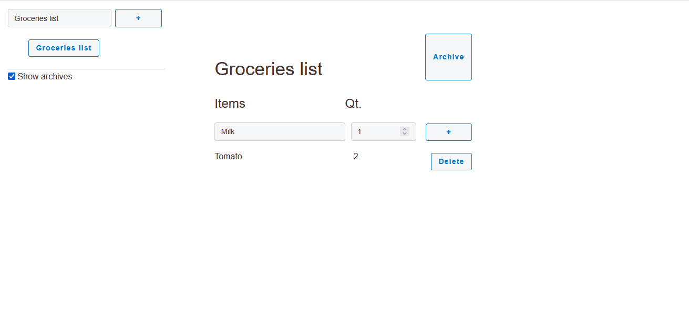
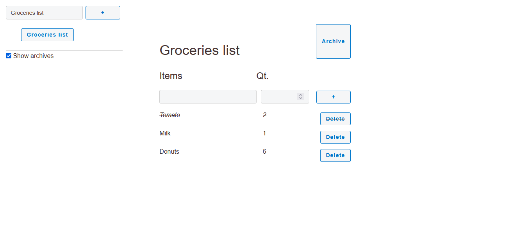
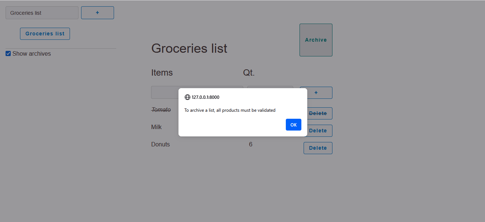
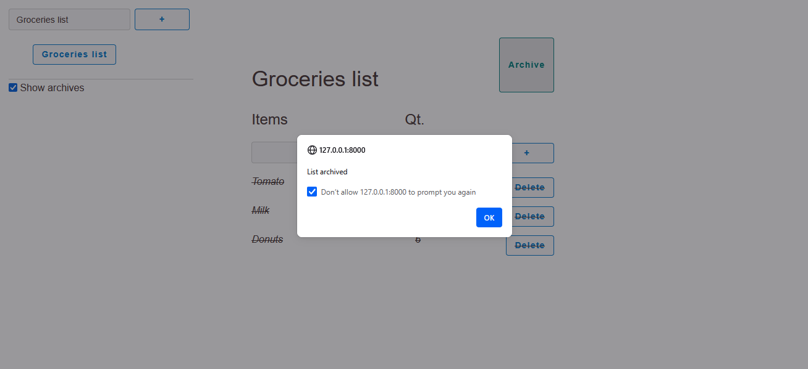
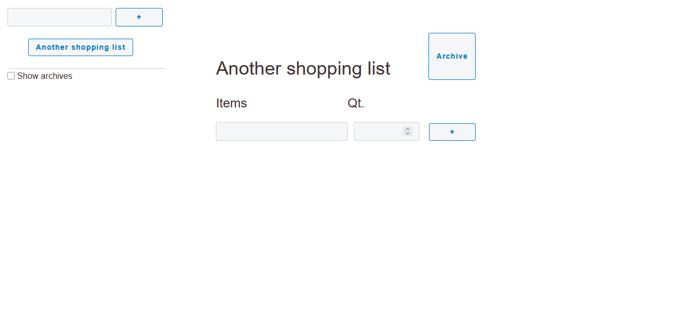

# Lists of lists

A very basic shopping list app made using Python and FastApi

## 🔍 Project Overview

This project was made while I was at Simplon. 

With this app you can create and archive lists, add/delete/validate items in created lists.

The main goals of this project were :
- Practice implementing a complete REST API with all CRUD operations
- Learn how HTML/JavaScript frontends communicate with Python backends via HTTP
- Understand the request-response cycle in web applications
- Build something functional while exploring full-stack development concepts

I've chosen SQLModel ORM as the interface layer between my SQLite database and Python objects, combined with Jinja2 for template rendering.

## 📚 Stack

- Back: Python • FastApi • SQLite • SQLModel
- Front: HTML • CSS • JavaScript • Jinja2
- uv • Git

## 🛠️ Installation

### Pre-requisites

* Python <= 3.13 
* [uv](https://docs.astral.sh/uv/) package and dependency manager

### Setup

```bash
# Clone or download the repository
git clone https://github.com/matth-dev/lists.git
cd lists
uv sync
```

## 🎯 Usage

```bash
cd lists
uv run fastapi run app/main.py
```
Then, in your browser go to `http://localhost:8000`

> Click on an item name or quantity to "validate" it

> Lists can be deleted by going to the app swagger `http://localhost:8000/docs`: You will have access to all CRUD operations but you'll need the list ID.

## 📸 Screenshots

Here are screenshots of the app to show the main features.








## 📅 Roadmap

✅ Done but any comments are welcome! 